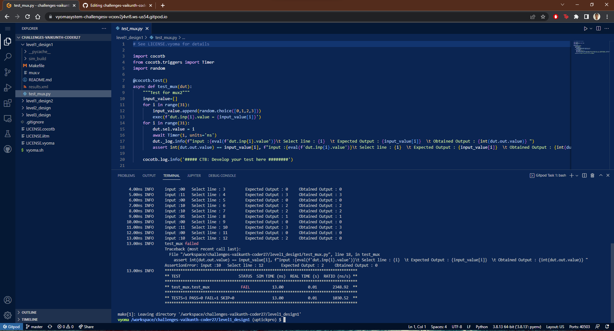
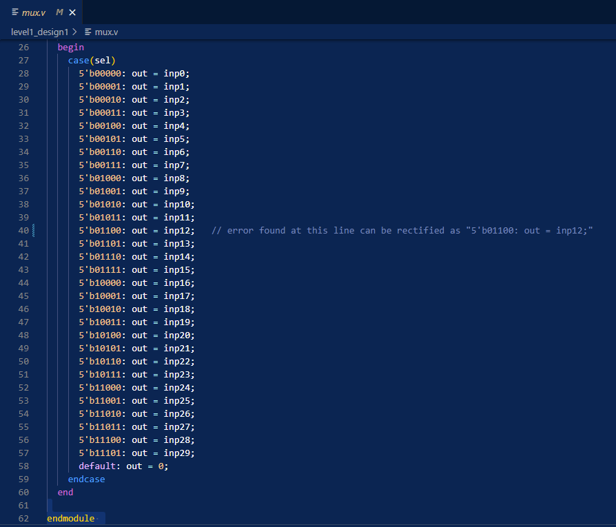
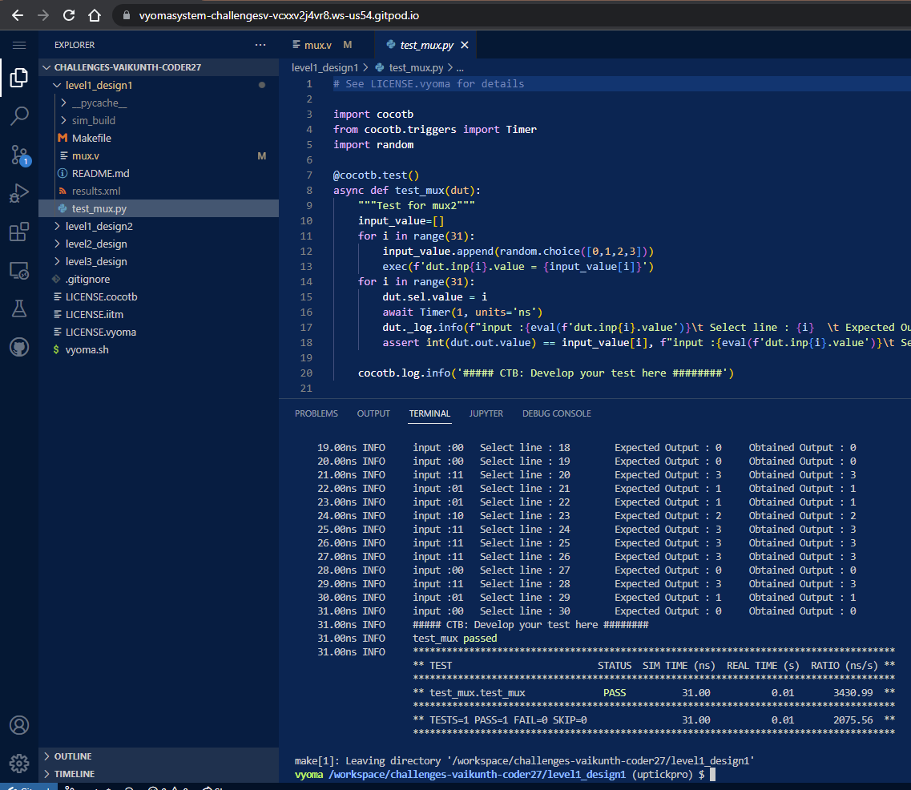

# MUX



## Verification Environment
The testbench drives inputs to the Design Under Test using dut.&lt;input-port-name&gt;.value = &lt;value&gt;


The assert statement is used for comparing the output from the mux with the expected value.

```
assert int(dut.out.value) == input_value[i], f"input :{eval(f'dut.inp{i}.value')}\t Select line : {i}  \t Expected Output : {input_value[i]}  \t Obtained Output : {int(dut.out.value)} "
```


## Bug
Based on the above test input and analysing the design, we see the following




## Design Fix
Updating the design and re-running the test makes the test pass.



The updated design is checked in as seq_detect_1011_corrected.v

## Verification Strategy
- on analyzing the output obtained and comparing with the individual input the bug location is identified and rectified 

## Is the verification complete ?
 Verification is complete, many test cases have been simulated.
