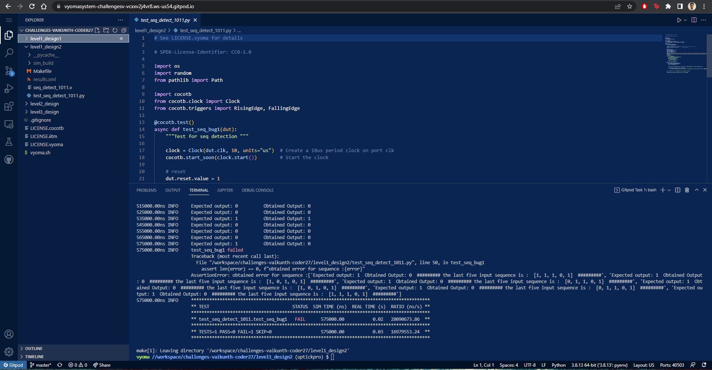
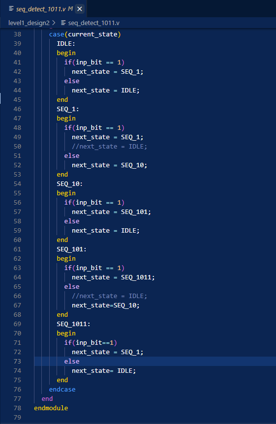
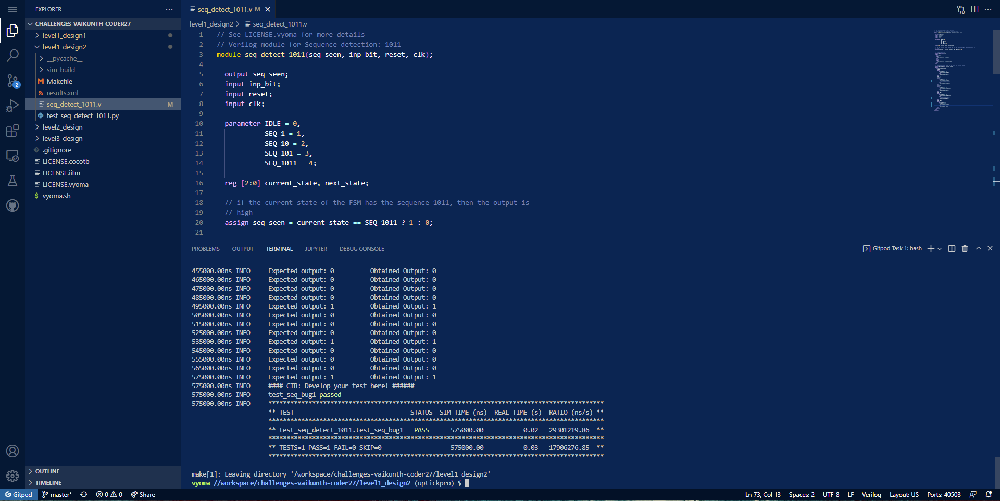

# Sequence Detector Design Verification




## Verification Environment
The testbench drives inputs to the Design Under Test using dut.&lt;input-port-name&gt;.value = &lt;value&gt;

The sequence detector is a sequencial device, which uses a clock.
In CoCoTb, we simulate clock using
```
from cocotb.clock import Clock

clock = Clock(dut.clk, 10, units="us")  
cocotb.start_soon(clock.start())    
```

The assert statement is used for comparing the output from the sequence detector with the expected value.

```
if(not int(dut.seq_seen.value) == solution[i]):
            error.append(f"Expected output: {solution[i]}  Obtained Output: {int(dut.seq_seen.value)}  ######### the last five input sequence is :  {input_values[i-5:i]}  #########")


    assert len(error) == 0, f"obtained error for sequence :{error}"
```

We can log the output from the DUT using `dut._log.info()` 


## Bug
Based on the above test input and analysing the design, we see the following



- The next state for SEQ_1 for 1 input should be SEQ_1 instead of IDLE

- The next state for SEQ_101 for 0 input should be SEQ_10 instead of IDLE

- For SEQ_1011 state, we add state transition to SEQ_1 for 1 input

## Design Fix
Updating the design and re-running the test makes the test pass.



The updated design is checked in as seq_detect_1011_corrected.v

## Verification Strategy
Randomly assign and verify the logic given, check if the design functions as per the design specifications.

## Is the verification complete ?
 Verification is complete, many test cases have been simulated.
