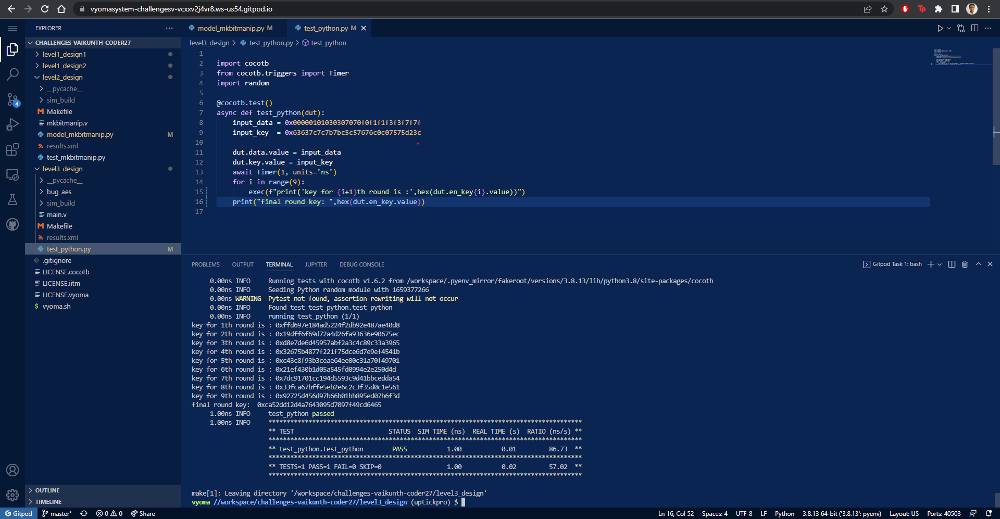
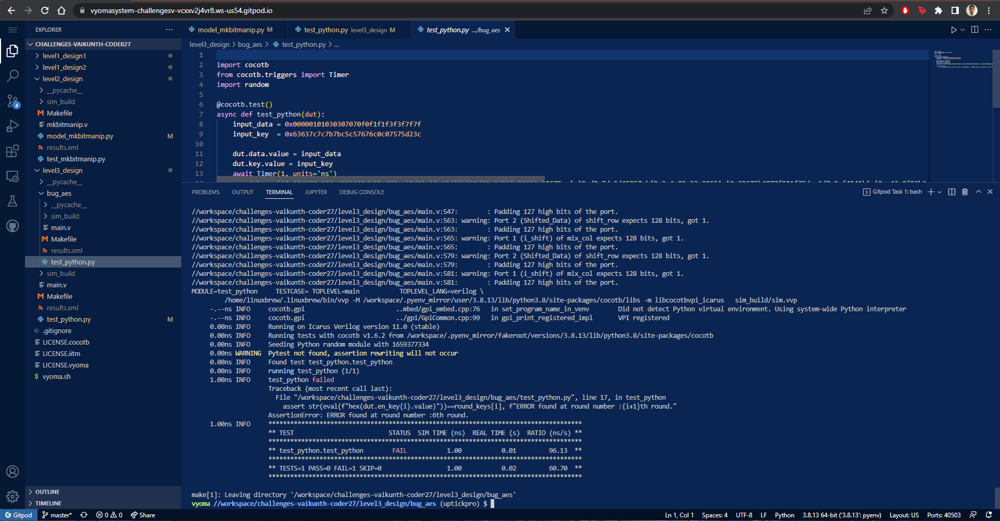

# AES 128 ENCRYPTION 




## Verification Environment
The testbench drives inputs to the Design Under Test using dut.&lt;input-port-name&gt;.value = &lt;value&gt;


The assert statement is used for comparing the output from the sequence detector with the expected value.

```
assert str(eval(f"hex(dut.en_key{i}.value)"))==round_keys[i], f"ERROR found at round number :{i+1}th round."
```

## Bug
based on the above program we insert a bug to observe the functionality




## Is the verification complete ?
 Verification is complete.
